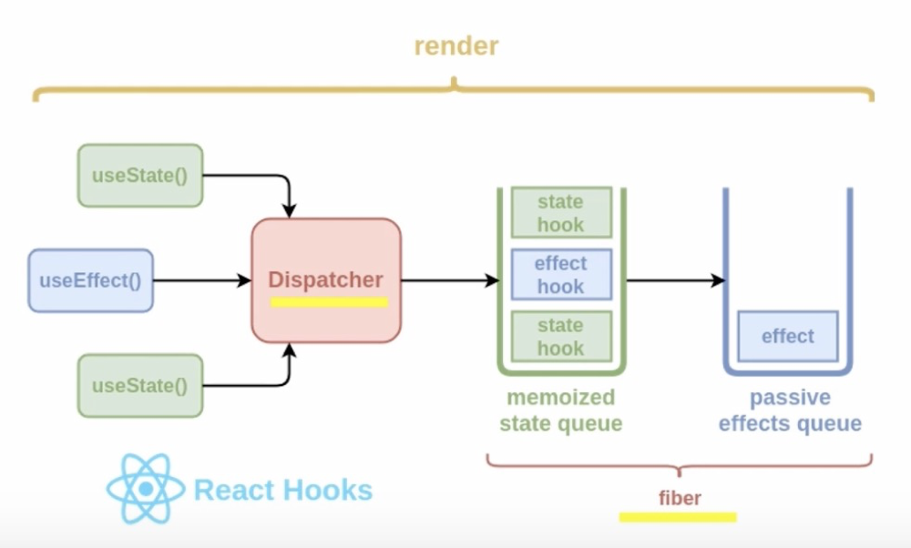

## class 组件和函数式组件的区别

- 函数式组件是一个纯函数，没有组件实例，也没有生命周期方法，只能接收 props 作为参数；
- class 组件是一个类，有自己的实例，可以使用 state 和 setState 管理内部状态，也可以使用生命周期方法控制组件的更新和销毁；
- 函数式组件在更新时会重新执行函数，得到返回的 React 元素后就销毁中间变量；class 组件在更新时会重新调用 render 方法，但原来的实例还是原来的实例；
- 函数式组件可以使用 React hooks 功能，实现状态管理、生命周期方法、自定义逻辑等功能；class 组件可以使用更多的 React 特性，如错误边界、静态方法等；
- 函数式组件更符合函数式编程的思想，更简洁、纯粹、易于测试；class 组件更符合面向对象编程的思想，更灵活、丰富、易于扩展。

口语化回答

作为组件而言 函数组件和类组件 在使用上和呈现上没有任何不同，性能在现代浏览器中也不会有明显的差异，他们在开发时的心智模型是最大的不同 类组件主要是面向对象编程（oop）生命周期的核心概念，而函数组件主要是函数式编程（FP）主打的是 没有副作用 引用透明等，性能上 类组件主要通过 shouldcomponentupdate 提升性能 函数组件主要通过 memo 来提升性能，从上手程度上看 函数组件更容易上手 社区也主推 使用 hook 的函数组件

## 介绍下 hooks

React Hooks 是一种函数，它可以让你在函数组件中 使用 React 的状态和生命周期特性。Hooks 不在类中工作——它们让你在不使用类的情况下使用 React。Hooks 在 React 16.8 版本中被添加，它们允许函数组件访问状态和其他 React 功能。因此，通常不再需要类组件

## diff 算法

## react 渲染优化

## 组件通信

## react-router 原理

## 长列表优化

## react 15 和 16 的区别

react 16 服务器渲染 比 15 快了三倍
react 16 比 15 体积更小一点

react 15 架构分为两层

- Reconciler 协调器 通过 diff 算法 找出变化的 组件 然后交给 渲染器
- Renderer 渲染器 将变化的组件重新渲染

react 15 的更新机制

首先由 Reconciler（协调器）通过 diff 算法计算出需要更新的组件，然后通过 Renderer（渲染器）去执行更新并渲染组件。接着继续由 Reconciler 计算出需要更新的组件，Renderer 继续更新渲染。整个过程是同步的，Reconciler 与 Renderer 交替进行的。并且使用递归实现，所以不可中断。

react 16 架构分为三层

- Scheduler（调度器） 调度任务优先级，使优先级高的任务进入 Reconciler
- Reconciler（协调器） 通过 diff 算法找出变化的组件交给 Renderer 渲染器。
- Renderer（渲染器） 负责将变化的组件重新渲染。

react 16 的更新机制

首先由 Scheduler（调度器）去调度任务的优先级，将优先级比较高的任务加入到 Reconciler（协调器）中。Reconciler（协调器）通过 diff 算法计算出需要更新的组件，并标记更新状态。等整个组件更新完成之后，再通过 Renderer（渲染器）去执行更新并渲染组件。

Reconciler （协调器）是通过可中断的循环去计算出需要更新的组件，并且是等整个组件协调完之后再通过 Renderer 渲染更新

## fiber 原理

## useEffect 和 useLayoutEffect 的区别

共同点

1. 函数签名一致
   > mdn 中 js 中签名的解释是： JavaScript 是一种松散类型 或 动态语言。这意味着您不必提前声明变量的类型。处理程序时，将自动确定类型。JavaScript 中的签名仍然可以为您提供有关该方法的一些信息：
   > `MyObject.prototype.myFunction(value)`
   - 该方法是安装在一个名为 MyObject 的 对象上。
   - 该方法安装在 MyObject 的原型上
   - 该方法的名称是 myFunction。
   - 该方法接受一个叫 value 的参数，且没有进一步定义。
2. 都是处理副作用

不同点：

使用场景 useEffect 绝大数场景 useLayoutEffect 处理 dom 样式变更避免闪烁问题
useEffect 是异步处理副作用（异步调用） useLayoutEffect 是同步处理副作用（同步调用）

hook 都是以链表的形式 挂载到 fiber.memoizedState 队列上 所以这样 hook 才和组件关联在一起

effect hook 会有些不同 它涉及到一些额外的处理逻辑 每个 fiber 的 hooks 队列上保存了 effect 的节点，而每个 effect 类型都有可能不同，需要在合适的阶段去执行

## react 事件机制

## 类组件 hoc

## hooks 代码复用的缺点

## shouldcomponentupdate

## useCallback 和 useMemo 底层原理

## 为什么引入 unsafe

因为 React Fiber Reconciliation 这个过程有可能暂停然后继续执行，所以挂载和更新之前的生命周期钩子就有可能不执行或者多次执行；

1. React 意识到 componentWillMount、componentWillReceiveProps 和 componentWillUpdate 这三个生命周期函数有缺陷，比较容易导致崩溃。但是由于旧的项目已经在用以及有些老开发者习惯用这些生命周期函数，于是通过给它加 UNSAFE\_来提醒用它的人要注意它们的缺陷。
2. React 加入了两个新的生命周期函数 getSnapshotBeforeUpdate 和 getDerivedStateFromProps，目的为了即使不使用这三个生命周期函数，也能实现只有这三个生命周期能实现的功能。

## 为什么 commit 阶段不会多次调用

## hooks 使用限制

限制有

1. 只能在函数组件中使用 hook
2. 不能循环 条件或者嵌套函数中使用 hook

为什么有这些限制呢？

为了改进 react 组件开发模式 在 class 开发模式 遇到了三个问题

1. 组件之间难以复用状态逻辑（高阶组件 render props 状态管理框架）
2. 复杂的组件变的难以理解（生命周期函数和业务耦合 组件关联部分难以拆分）
3. 人和机器都容易混淆的类 比如 this 问题 以及 编译优化 类

所以 hook 是基于函数组件 开发的 所以只能在函数组件中使用

hook 原理是基于数组实现 如果在条件 循环嵌套函数中使用 可能会导致 hook 错位 让 hook 的取值有问题 在 react 源码中 hook 是基于链表实现

那么怎么解决这个问题呢 引入 eslint hook 检查插件

## redux 中间件原理
